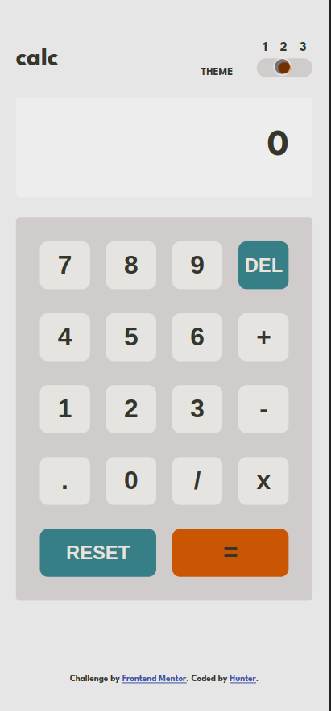

# Frontend Mentor - Calculator app solution

This is a solution to the [Calculator app challenge on Frontend Mentor](https://www.frontendmentor.io/challenges/calculator-app-9lteq5N29). Frontend Mentor challenges help you improve your coding skills by building realistic projects. 

## Table of contents

- [Overview](#overview)
  - [The challenge](#the-challenge)
  - [Screenshot](#screenshot)
  - [Links](#links)
- [My process](#my-process)
  - [Built with](#built-with)
  - [What I learned](#what-i-learned)
- [Author](#author)

**Note: Delete this note and update the table of contents based on what sections you keep.**

## Overview

### The challenge

Users should be able to:

- See the size of the elements adjust based on their device's screen size
- Perform mathmatical operations like addition, subtraction, multiplication, and division
- Adjust the color theme based on their preference
- **Bonus**: Have their initial theme preference checked using `prefers-color-scheme` and have any additional changes saved in the browser

### Screenshot
- **Desktop Design**


- **Mobile Design**

<div align="center">
  
</div>

### Links

- Solution URL: [My solution](https://github.com/huntoor/Frontend-Mentor/tree/main/calculator-app-main)
- Live Site URL: [Github Page](https://huntoor.github.io/Frontend-Mentor/calculator-app-main)

## My process

### Built with

- Semantic HTML5 markup
- CSS custom properties
- Flexbox
- Desktop-first workflow
- Javascript

### What I learned

```js
const activateTheme = (event) => {
  localStorage.setItem("Theme", themeSwitch.value);
  switch (Number(themeSwitch.value)) {
    case 1:
      themeStylesheetLink.href = "./css/themes/default.css";
      break;

    case 2:
      themeStylesheetLink.href = "./css/themes/light.css";
      break
    
    case 3:
      themeStylesheetLink.href = "./css/themes/dark.css";
      break;

    default:
      themeStylesheetLink.href = "./css/themes/default.css";
      break;
  };
}
```

In this snippet, I used the ``localStorage`` to store the user's theme choice.
```js
themeSwitch.value = localStorage.getItem("Theme") || 1;

```

## Author

- Frontend Mentor - [@huntoor](https://www.frontendmentor.io/profile/huntoor)
- Twitter - [@Hunt00r](https://twitter.com/Hunt00r)
