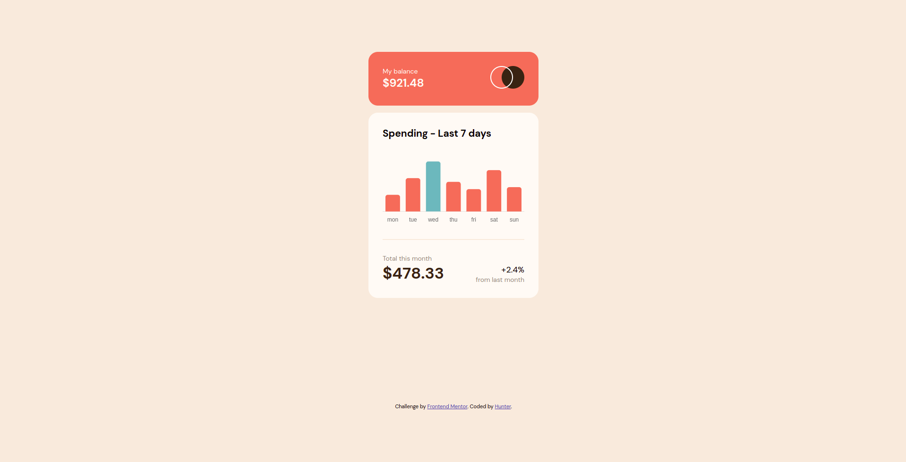
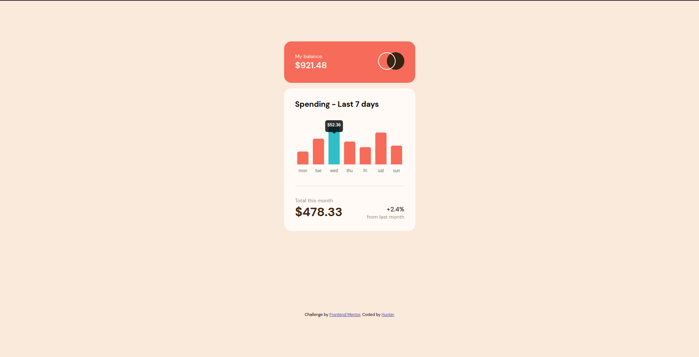

# Frontend Mentor - Expenses chart component solution

This is a solution to the [Expenses chart component challenge on Frontend Mentor](https://www.frontendmentor.io/challenges/expenses-chart-component-e7yJBUdjwt). Frontend Mentor challenges help you improve your coding skills by building realistic projects. 

## Table of contents

- [Overview](#overview)
  - [The challenge](#the-challenge)
  - [Screenshot](#screenshot)
  - [Links](#links)
- [My process](#my-process)
  - [Built with](#built-with)
  - [What I learned](#what-i-learned)
  - [Useful resources](#useful-resources)
- [Author](#author)

## Overview

### The challenge

Users should be able to:

- View the bar chart and hover over the individual bars to see the correct amounts for each day
- See the current day’s bar highlighted in a different colour to the other bars
- View the optimal layout for the content depending on their device’s screen size
- See hover states for all interactive elements on the page
- **Bonus**: Use the JSON data file provided to dynamically size the bars on the chart

### Screenshot





### Links

- Solution URL: [Solution URL](https://github.com/huntoor/Frontend-Mentor/tree/main/expenses-chart-component-main)
- Live Site URL: [Github Page](https://huntoor.github.io/Frontend-Mentor/expenses-chart-component-main)

## My process

### Built with

- Semantic HTML5 markup
- CSS
- Flexbox
- Javascript
- [Chart.js](https://www.chartjs.org/docs/latest/) - JS library

### What I learned

I've learned how to use chart.js to make bar charts, and I've practiced using `fetch()` to get the data from `file.json` and use this data in my code.

In this code snippet, I've used `fetch()` to get data from `data.json` and add it to `jsonData` so that I can use them to draw the graph and get the data I need.
```js
fetch("/data.json")
  .then(res => res.json())
  .then(data => {
    data.forEach((d) => {
      jsonData.day.push(d.day);
      jsonData.amount.push(d.amount);
      jsonData.backgroundColor.push('hsl(10, 79%, 65%)');
    });
    const maxAmountIndex = jsonData.amount.indexOf(Math.max(...jsonData.amount));
    jsonData.backgroundColor.splice(maxAmountIndex, 1, 'hsl(186, 34%, 60%)');
  })
  .then(() => {
    drawChart(jsonData);
  })
  .catch(err => {
    throw new Error(err)
  });
```

### Useful resources

- [How to fetch local JSON](https://stackoverflow.com/questions/49481934/fetching-local-json) - This helped me for featching from local JSON file.
- [chart.js Documentation](https://www.chartjs.org/docs/latest/) - This is chart.js documentation, It helped me a lot in designing the chart.

## Author

- Frontend Mentor - [@huntoor](https://www.frontendmentor.io/profile/huntoor)
- Github - [Hunter](https://github.com/huntoor)
- Twitter - [@Hun00r](https://twitter.com/Hunt00r)
